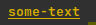
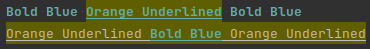

## ANSITerminalColor

[](https://www.nuget.org/packages/Socolin.ANSITerminalColor)


Helpers to generate [ANSI escape codes](https://en.wikipedia.org/wiki/ANSI_escape_code)

## License

[MIT](Socolin.ANSITerminalColor/LICENSES.md)

## Disable color

You can disable coloring with `AnsiColor.NoColor = true`

## Examples

Colorize a text before printing it to the console

```csharp
Console.WriteLine(AnsiColor.ColorizeText("Colored Text", AnsiColor.Bold))
Console.WriteLine(AnsiColor.ColorizeText("Colored Text", AnsiColor.Foreground(Terminal256ColorCodes.Aquamarine1C86)))
```

Composite multiple modifiers


```csharp
Console.WriteLine(AnsiColor.ColorizeText(
    "some-text",
    AnsiColor.Composite(
        AnsiColor.Bold,
        AnsiColor.Underline,
        AnsiColor.Foreground(Terminal256ColorCodes.Gold3C178)
    )));
```

Using RGB Colors

```csharp
Console.WriteLine(AnsiColor.ColorizeText(
    "some-text",
    AnsiColor.Foreground(255, 16, 240)
);
```

Using `Colorize()`

```csharp
Console.WriteLine(AnsiColor.Foreground(45, 150, 240).Colorize("Text"));
```

Use multiple code on the same text



```csharp
var boldBlue = AnsiColor.Composite(
    AnsiColor.Foreground(Terminal256ColorCodes.CadetBlueC73),
    AnsiColor.Bold
);
var orangeBackgroundUnderline = AnsiColor.Composite(
    AnsiColor.Background(Terminal256ColorCodes.Orange4C58),
    AnsiColor.Underline
);
Console.WriteLine(boldBlue.Colorize("Bold Blue " + orangeBackgroundUnderline.Colorize("Orange Underlined") + " Bold Blue"));
Console.WriteLine(orangeBackgroundUnderline.Colorize("Orange Underlined " + boldBlue.Colorize("Bold Blue") + " Orange Underlined"));
```


More escape sequence can be used when using `new AnsiColor(...)`